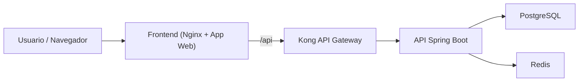

# ExpenseTracker

## Descripcion

ExpenseTracker es una plataforma de gestion de gastos personales orientada a centralizar el registro, consulta y analisis de movimientos financieros desde una interfaz web moderna.

El sistema permite a los usuarios registrar gastos, consultar categorias, visualizar reportes y consumir la funcionalidad del backend a traves de un API Gateway. Su objetivo es ofrecer una arquitectura desacoplada, facil de desplegar y preparada para entornos locales o academicos mediante contenedores.

El problema principal que resuelve es la dificultad de consolidar el seguimiento de gastos en una aplicacion con separacion clara entre interfaz, logica de negocio, enrutamiento de APIs y servicios de persistencia. El publico objetivo incluye estudiantes, desarrolladores, equipos de arquitectura de software y usuarios que necesiten una base funcional para gestionar gastos personales.

## Arquitectura del sistema

ExpenseTracker sigue una arquitectura basada en servicios orquestados con Docker Compose. Cada componente tiene una responsabilidad bien definida y se comunica sobre una red compartida para mantener separacion de responsabilidades y facilidad de mantenimiento.

### Componentes principales

- **Frontend**: interfaz de usuario del sistema. Se construye como aplicacion web y se publica mediante Nginx. Recibe las solicitudes del navegador y reenvia las rutas `/api` hacia Kong.
- **API**: backend principal desarrollado con Spring Boot. Implementa la logica de negocio, seguridad, acceso a datos, reportes y endpoints REST.
- **Kong**: API Gateway encargado de enrutar las solicitudes entrantes hacia la API, centralizando el acceso a los servicios backend.
- **PostgreSQL**: base de datos relacional principal para persistencia de usuarios, gastos, categorias y demas entidades del dominio.
- **Redis**: servicio de cache y almacenamiento en memoria usado por el backend para funcionalidades de soporte y rendimiento.

### Flujo de comunicacion

```text
Usuario -> Frontend -> Kong -> API -> PostgreSQL / Redis
```

### Vista general de la arquitectura



### Rol del frontend

El frontend expone la interfaz de usuario en `http://localhost:3000`. Desde el punto de vista del navegador, las llamadas al backend se realizan a traves de la ruta relativa `/api`, lo que evita dependencias directas con `localhost:8080` y permite desacoplar la capa cliente del backend.

### Rol del backend

La API Spring Boot concentra la logica del dominio, autenticacion, validaciones, acceso a base de datos y exposicion de endpoints REST. Ademas, incorpora un endpoint de salud para verificaciones operativas del despliegue:

- `GET /api/health`

### Rol del API Gateway

Kong funciona como punto de entrada para las solicitudes dirigidas al backend. Su configuracion es declarativa y se monta desde el archivo:

- `/usr/local/kong/declarative/kong.yml`

El gateway expone:

- Proxy: `http://localhost:8000`
- Admin API: `http://localhost:8001`

### Rol de PostgreSQL

PostgreSQL almacena la informacion persistente del sistema. En el despliegue principal:

- Host local: `localhost`
- Puerto: `5433`
- Base de datos: `expense_tracker`
- Usuario: `postgres`
- Contrasena: `postgres`

### Rol de Redis

Redis ofrece almacenamiento en memoria para soporte de cache y otras operaciones transitorias requeridas por el backend.

- Host local: `localhost`
- Puerto: `6379`

## Estructura del proyecto

La solucion esta organizada por componentes para facilitar el desarrollo, la construccion de imagenes y el despliegue con Docker Compose.

```bash
project-root/
├── expensetracker-frontend/
├── expensetracker-backend/
├── kong/
├── docker-compose.yml
└── README.md
```

### Carpetas principales

- `expensetracker-frontend/`: contiene la aplicacion cliente, su configuracion de build y el servidor web Nginx para despliegue.
- `expensetracker-backend/`: contiene el servicio backend en Spring Boot, la configuracion de negocio, controladores, servicios, repositorios y Dockerfile.
- `kong/`: incluye la configuracion declarativa de Kong para exponer y enrutar la API.
- `docker-compose.yml`: orquestacion principal de todos los servicios del sistema.

## Tecnologias utilizadas

- **Frontend**: aplicacion web cliente
- **Backend**: Spring Boot
- **API Gateway**: Kong
- **Base de datos**: PostgreSQL
- **Cache / memoria**: Redis
- **Contenerizacion**: Docker
- **Orquestacion local**: Docker Compose

## Requisitos previos

Para ejecutar el proyecto localmente se recomienda contar con:

- Docker Desktop instalado y en ejecucion
- Docker Compose disponible
- Puertos libres en la maquina local:
  - `3000`
  - `5433`
  - `6379`
  - `8000`
  - `8001`
  - `8080`

## Despliegue con Docker Compose

El despliegue principal del sistema se realiza desde la raiz del proyecto.

### Levantar el sistema

```bash
docker compose up --build
```

### Levantar en segundo plano

```bash
docker compose up -d --build
```

### Detener el sistema

```bash
docker compose down
```

### Importante sobre persistencia

El proyecto esta configurado para reutilizar volumenes Docker existentes y preservar informacion previa. No se debe ejecutar `docker compose down -v` si se desea conservar los datos almacenados.

## Servicios y puertos

| Servicio | Descripcion | Puerto local | Puerto interno |
|---|---|---:|---:|
| frontend | Interfaz web publicada con Nginx | `3000` | `80` |
| api | Backend Spring Boot | `8080` | `8080` |
| kong | Proxy del API Gateway | `8000` | `8000` |
| kong-admin | Administracion de Kong | `8001` | `8001` |
| postgres | Base de datos PostgreSQL | `5433` | `5432` |
| redis | Cache / almacenamiento en memoria | `6379` | `6379` |

## Configuracion del entorno

### Variables relevantes del backend

La API utiliza las siguientes variables en el despliegue principal:

```env
SPRING_DATASOURCE_URL=jdbc:postgresql://postgres:5432/expense_tracker
SPRING_DATASOURCE_USERNAME=postgres
SPRING_DATASOURCE_PASSWORD=postgres
SPRING_DATA_REDIS_HOST=redis
SPRING_DATA_REDIS_PORT=6379
APP_CORS_ALLOWED_ORIGINS=http://localhost:3000
```

### Configuracion de PostgreSQL

```env
POSTGRES_DB=expense_tracker
POSTGRES_USER=postgres
POSTGRES_PASSWORD=postgres
```

### Configuracion de Kong

Kong utiliza modo declarativo sin base de datos:

- `KONG_DATABASE=off`
- `KONG_DECLARATIVE_CONFIG=/usr/local/kong/declarative/kong.yml`

## Persistencia de datos

Los datos del sistema se conservan mediante volumenes Docker externos reutilizados por el despliegue principal:

- PostgreSQL: `expensetracker-backend_postgres_data`
- Redis: `expensetracker-backend_redis_data`

Esto permite:

- mantener los datos entre reinicios de contenedores
- reutilizar una base previamente poblada
- levantar todo el stack desde un unico `docker compose up --build`

## Red de contenedores

Todos los servicios se comunican mediante la red:

- `expense-tracker-network`

Esta red permite resolucion por nombre entre contenedores, por ejemplo:

- `frontend -> kong`
- `kong -> api`
- `api -> postgres`
- `api -> redis`

## Enrutamiento y flujo de solicitudes

Una vez desplegado el sistema:

1. El usuario accede al frontend en `http://localhost:3000`
2. El frontend sirve la aplicacion web y redirige las solicitudes `/api` hacia Kong
3. Kong recibe la solicitud y la enruta al servicio `api`
4. La API procesa la peticion y accede a PostgreSQL y/o Redis segun corresponda
5. La respuesta retorna al frontend y finalmente al navegador

Este enfoque desacopla el cliente del backend y permite centralizar la exposicion del API a traves del gateway.

## Healthchecks y monitoreo basico

El despliegue incluye verificaciones de salud para mejorar la operacion del stack:

- API:
  - `http://localhost:8080/api/health`
- PostgreSQL:
  - `pg_isready`
- Redis:
  - `redis-cli ping`

Estas validaciones se usan dentro de Docker Compose para controlar dependencias y orden de arranque.

## Operacion y comandos utiles

### Ver estado de los servicios

```bash
docker compose ps
```

### Ver logs de todos los servicios

```bash
docker compose logs -f
```

### Ver logs de un servicio especifico

```bash
docker compose logs -f frontend
docker compose logs -f api
docker compose logs -f kong
docker compose logs -f postgres
docker compose logs -f redis
```

### Reconstruir una imagen especifica

```bash
docker compose build frontend
docker compose build api
```

### Reiniciar un servicio

```bash
docker compose restart api
```

## Endpoints y accesos principales

### Acceso a la aplicacion

- Frontend: `http://localhost:3000`
- API directa: `http://localhost:8080`
- Kong Proxy: `http://localhost:8000`
- Kong Admin API: `http://localhost:8001`

### Endpoint de salud

- API Health: `http://localhost:8080/api/health`

## Consideraciones de desarrollo

- El frontend esta preparado para consumir la API a traves de la ruta `/api`.
- Kong actua como intermediario entre cliente y backend.
- La API permanece accesible en `http://localhost:8080` para pruebas tecnicas o diagnostico.
- La persistencia se mantiene aunque se detengan los contenedores, siempre que no se eliminen los volumenes.

## Seguridad y buenas practicas

- No ejecutar `docker compose down -v` si se requiere conservar la informacion persistida.
- Mantener credenciales y configuraciones sensibles fuera de repositorios publicos en entornos reales.
- Restringir la Admin API de Kong en despliegues productivos.
- Sustituir credenciales por defecto antes de un despliegue fuera de entorno local o academico.

## Solucion de problemas

### El frontend no responde en `localhost:3000`

Verificar:

- que Docker Desktop este en ejecucion
- que el contenedor `frontend` este levantado
- que el puerto `3000` no este ocupado por otro proceso

### La API no conecta con PostgreSQL

Verificar:

- que el contenedor `postgres` este en estado `healthy`
- que el volumen `expensetracker-backend_postgres_data` exista
- que las variables `SPRING_DATASOURCE_*` apunten al host `postgres`

### Kong responde pero no enruta correctamente

Verificar:

- que el contenedor `api` este saludable
- que el archivo `kong/kong.yml` se haya montado correctamente
- que Kong este disponible en `http://localhost:8000`

### Redis no responde

Verificar:

- que el contenedor `redis` este activo
- que el puerto `6379` no este ocupado
- que la API use `SPRING_DATA_REDIS_HOST=redis`

## Roadmap sugerido

Posibles mejoras futuras para el proyecto:

- variables de entorno separadas por entorno
- autenticacion y autorizacion endurecidas para produccion
- observabilidad con metricas y trazas
- pipelines CI/CD para build y validacion automatica
- despliegue en Kubernetes o plataforma cloud

## Autor

Proyecto: **ExpenseTracker**

Si este repositorio se utiliza con fines academicos, profesionales o de portafolio, se recomienda complementar este README con diagramas de dominio, evidencias de pruebas y decisiones de arquitectura.
